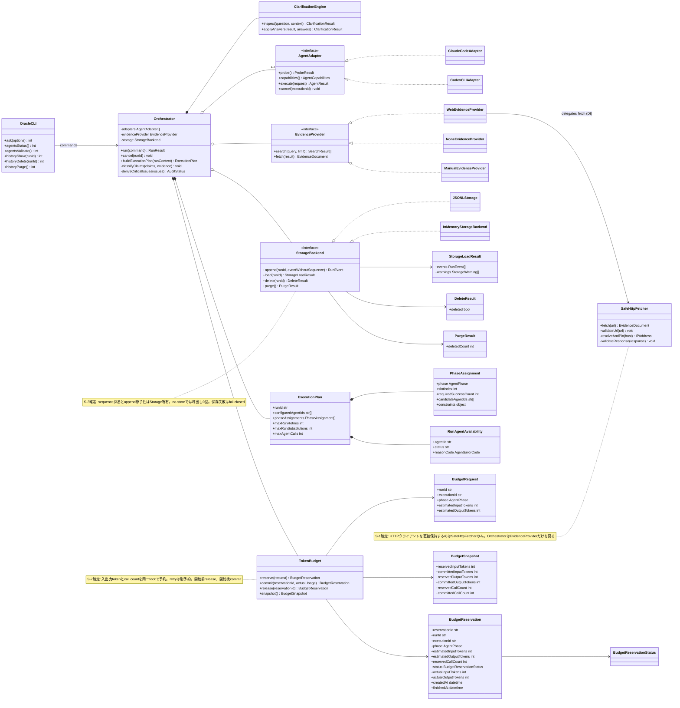
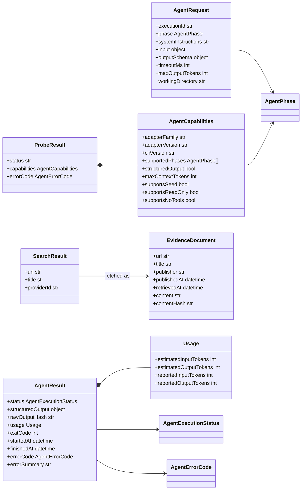

# Oracle Council クラス図

- 対象シーケンス: `SEQUENCE.md`
- 対象仕様: `SPEC.md` v0.3.9
- 対象範囲: MVPの`verify`モード、履歴、キャンセル
- 方針: シーケンスの参加オブジェクトをクラス責務へ割り当て、SPECで定義済みの型だけを確定要素として扱う

## 1. サービスとAdapter

## 2. 実行時ドメインモデル

```mermaid
classDiagram
    direction TB

    class Run {
        +runId str
        +createdAt datetime
        +originalQuestion str
        +refinedQuestion str
        +mode VerificationMode
        +riskLevel str
        +status RunStatus
        +finalAnswer str
        +resultClassification ResultClassification
        +consensusStatus ConsensusStatus
        +elapsedMs int
    }

    class Phase {
        +phaseId str
        +runId str
        +phase RunPhase
        +status PhaseStatus
        +startedAt datetime
        +finishedAt datetime
        +minimumSuccessCount int
        +successCount int
        +errorCode PhaseErrorCode
        +errorSummary str
        +rawDiagnostic str
        +outcome EvidenceOutcome
    }

    class AgentExecution {
        +executionId str
        +runId str
        +agentId str
        +phase AgentPhase
        +status AgentExecutionStatus
        +startedAt datetime
        +finishedAt datetime
        +elapsedMs int
        +exitCode int
        +response object
        +errorCode AgentErrorCode
        +errorSummary str
        +rawDiagnostic str
        +retryOf str
        +substituteFor str
    }

    class Claim {
        +claimId str
        +runId str
        +text str
        +importance ClaimImportance
        +status ClaimStatus
        +notes str
    }

    class Evidence {
        +evidenceId str
        +claimId str
        +url str
        +title str
        +publisher str
        +publishedAt datetime
        +retrievedAt datetime
        +authority EvidenceAuthority
        +directness EvidenceDirectness
        +stance EvidenceStance
        +freshness EvidenceFreshness
        +excerpt str
        +contentHash str
    }

    class AuditIssue {
        +issueId str
        +runId str
        +auditExecutionId str
        +issueType str
        +severity ClaimImportance
        +claimId str
        +status AuditIssueStatus
        +comment str
        +createdAt datetime
        +resolvedAt datetime
    }

    class RunMetadataRecord {
        +runId str
        +createdAt datetime
        +mode VerificationMode
        +riskLevel str
        +status RunStatus
        +resultClassification ResultClassification
        +consensusStatus ConsensusStatus
        +participantCount int
        +claimCount int
        +evidenceCount int
        +errorCodes str[]
        +elapsedMs int
        +contentSaved bool
    }

    class RunEvent {
        +runId str
        +sequence int
        +eventType str
        +createdAt datetime
        +payload object
    }

    Phase --> EvidenceOutcome
    Phase --> PhaseErrorCode
    Phase --> EvidenceErrorCode
    AgentExecution --> AgentErrorCode
    Run "1" *-- "1..*" Phase
    Run "1" *-- "0..*" AgentExecution
    Run "1" *-- "0..*" Claim
    Claim "1" *-- "0..*" Evidence
    Run "1" *-- "0..*" AuditIssue
    AgentExecution "0..1" --> "0..1" AgentExecution : retryOf
    AgentExecution "0..1" --> "0..1" AgentExecution : substituteFor
    Run ..> RunMetadataRecord : metadata snapshot
    RunMetadataRecord ..> RunEvent : persisted as

    note for Phase "S-2確定: errorCodeはPhaseErrorCode（evidence_collectはEvidenceErrorCodeも可）。errorSummaryは定型文のみ最大200字redaction済み。rawDiagnosticのみcontent区分。outcomeはevidence_collectのみ使用（M-4）"
    note for AgentExecution "errorSummaryはPhaseと同じ制限付きmetadata。rawDiagnosticはcontent区分でstore-content指定時のみ保存。retryOfとsubstituteForは排他的"
    note for AuditIssue "S-2確定: comment以外はmetadata区分。statusのopen->resolvedで再監査の解消を追跡する。accepted_riskはMVP対象外"
    note for Evidence "複数Claimとの共有方法は既存QandA K-4で未確定"
```

## 3. Adapter・Evidence DTO

## 4. 主要Enum

```mermaid
classDiagram
    direction LR

    class RunStatus {
        <<enumeration>>
        pending
        running
        completed
        partial
        failed
        cancelled
    }

    class PhaseStatus {
        <<enumeration>>
        pending
        running
        succeeded
        degraded
        failed
        skipped
        cancelled
    }

    class AgentExecutionStatus {
        <<enumeration>>
        pending
        running
        succeeded
        unavailable
        failed
        timed_out
        cancelled
    }

    class AgentPhase {
        <<enumeration>>
        clarify
        respond
        claim_extract
        verify
        criticize
        synthesize
        audit
    }

    class RunPhase {
        <<enumeration>>
        clarify
        respond
        claim_extract
        evidence_collect
        verify
        criticize
        synthesize
        audit
    }

    class EvidenceOutcome {
        <<enumeration>>
        evidence_found
        partial_evidence
        no_evidence
        conflicting_evidence
        not_applicable
    }

    class EvidenceErrorCode {
        <<enumeration>>
        SEARCH_UNAVAILABLE
        ALL_FETCH_BLOCKED
        EVIDENCE_TIMEOUT
        BUDGET_EXHAUSTED
        FETCH_FAILED
    }

    class PhaseErrorCode {
        <<enumeration>>
        MINIMUM_SUCCESS_NOT_MET
        PHASE_TIMEOUT
        PHASE_CANCELLED
        BUDGET_EXCEEDED
    }

    class BudgetReservationStatus {
        <<enumeration>>
        reserved
        committed
        released
    }

    class StorageErrorCode {
        <<enumeration>>
        STORAGE_WRITE_FAILED
        STORAGE_CORRUPTED
        STORAGE_LOCK_FAILED
        STORAGE_NOT_FOUND
    }

    class StorageWarning {
        <<enumeration>>
        TRUNCATED_TAIL
    }

    class ClaimImportance {
        <<enumeration>>
        critical
        major
        minor
    }

    class ClaimStatus {
        <<enumeration>>
        verified
        supported
        contradicted
        conflicting
        unverified
        not_applicable
    }

    class AuditStatus {
        <<enumeration>>
        approved
        changes_required
        blocked
    }

    class AuditIssueStatus {
        <<enumeration>>
        open
        resolved
    }

    class VerificationMode {
        <<enumeration>>
        quick
        verify
        strict
    }

    class AgentErrorCode {
        <<enumeration>>
        AUTH_REQUIRED
        QUOTA_EXCEEDED
        RATE_LIMITED
        TIMEOUT
        CONTEXT_OVERFLOW
        INVALID_OUTPUT
        COMMAND_NOT_FOUND
        UNSUPPORTED_VERSION
        UNSAFE_CAPABILITY
        CANCELLED
        EXECUTION_ERROR
        BUDGET_EXCEEDED
    }
```

## 5. 設計上の境界

- `Orchestrator`はフロー制御と状態集約を担当し、CLI固有処理、HTTP取得、永続化形式を直接実装しない
- `AgentAdapter`はCLI差異、schema検証、secret redaction、process treeの終了を担当する
- Claim状態はVerifierの自由判断ではなく、Verifierが返すEvidence分類をOrchestratorが決定規則へ適用して確定する
- `Run`はin-memoryモデル、`RunMetadataRecord`は既定永続化モデルとして分離する
- `Vote`と`Voter`はMVPで生成しないため図から除外する
- `AgentPhase`はAgentExecution用（AI呼び出しのみ）、`RunPhase`はPhaseレコード用（`evidence_collect`を含む）として分離する
- Run全体の`result_classification`はOrchestratorの二段判定（SPEC §15.3）で導出し、AIに決めさせない
- StorageBackendとTokenBudgetの状態・所有権はS-3/S-7/T-1/T-4で確定し、JSONL/InMemory/Fakeが同じContractへ従う

## 6. 未確定箇所

- K-4: 1つのEvidenceDocumentを複数Claimで共有する場合の関連
- L-5: フェーズ別`structured_output`のschema

S-1（Provider内部委譲）、M-4（RunPhase / EvidenceOutcome / EvidenceErrorCode）、R-1（終了コード）はSPEC v0.3.3、S-2/T-5はv0.3.4、S-3/S-7/T-1/T-4はv0.3.6、M-5/S-5はv0.3.9で確定し、本書へ反映済み。S-9、S-10は未解決のまま。
