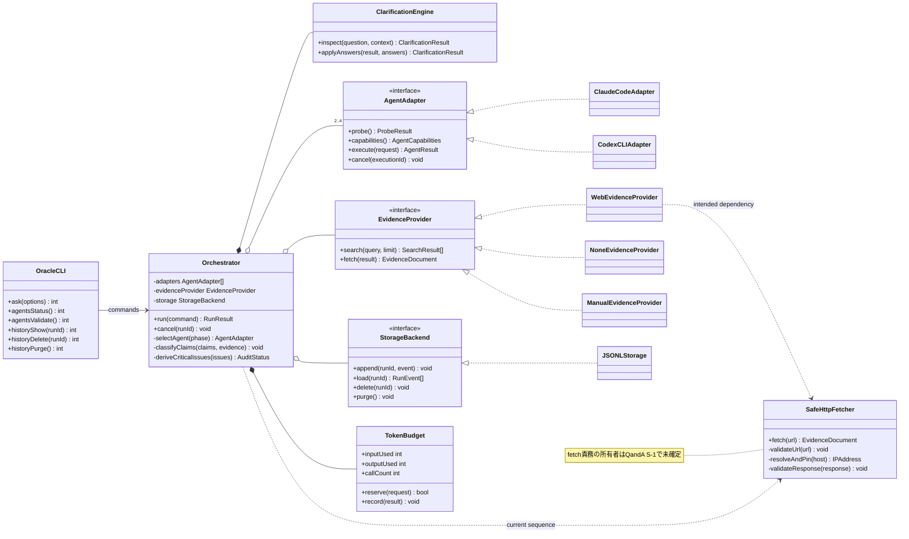
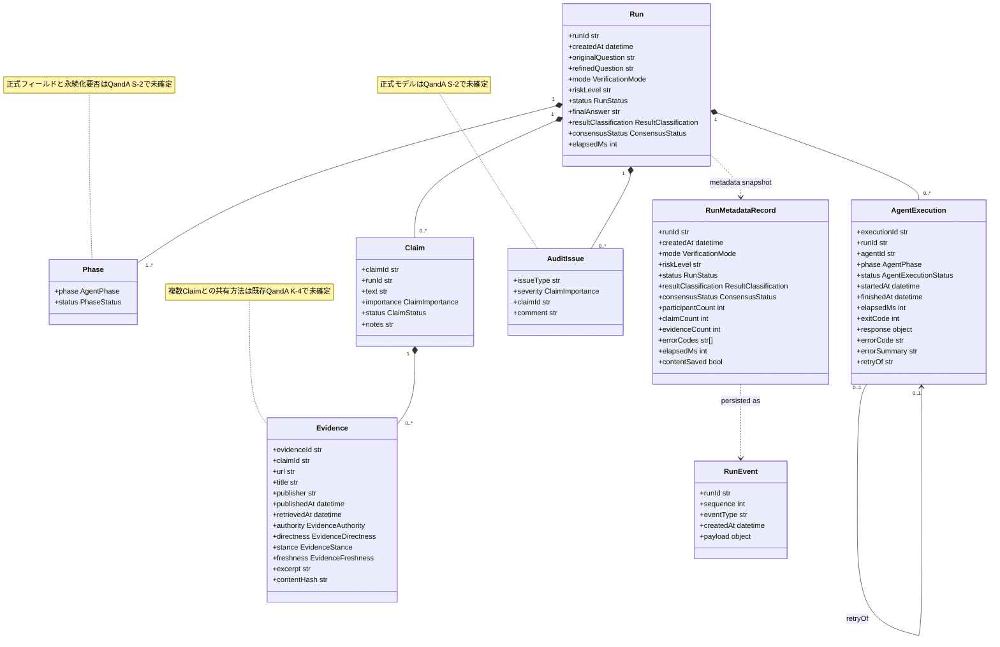
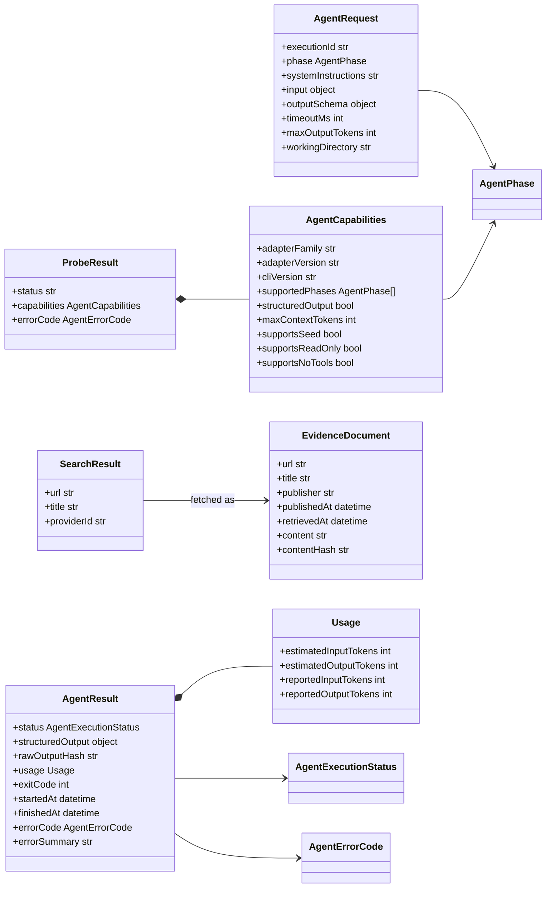

# Oracle Council クラス図

- 対象シーケンス: `SEQUENCE.md`
- 対象仕様: `SPEC.md` v0.3.2
- 対象範囲: MVPの`verify`モード、履歴、キャンセル
- 方針: シーケンスの参加オブジェクトをクラス責務へ割り当て、SPECで定義済みの型だけを確定要素として扱う

## 1. サービスとAdapter

## 2. 実行時ドメインモデル

## 3. Adapter・Evidence DTO

## 4. 主要Enum

```mermaid
classDiagram
    direction LR

    class RunStatus {
        <<enumeration>>
        pending
        running
        completed
        partial
        failed
        cancelled
    }

    class PhaseStatus {
        <<enumeration>>
        pending
        running
        succeeded
        degraded
        failed
        skipped
        cancelled
    }

    class AgentExecutionStatus {
        <<enumeration>>
        pending
        running
        succeeded
        unavailable
        failed
        timed_out
        cancelled
    }

    class AgentPhase {
        <<enumeration>>
        clarify
        respond
        claim_extract
        verify
        criticize
        synthesize
        audit
    }

    class ClaimImportance {
        <<enumeration>>
        critical
        major
        minor
    }

    class ClaimStatus {
        <<enumeration>>
        verified
        supported
        contradicted
        conflicting
        unverified
        not_applicable
    }

    class AuditStatus {
        <<enumeration>>
        approved
        changes_required
        blocked
    }

    class VerificationMode {
        <<enumeration>>
        quick
        verify
        strict
    }

    class AgentErrorCode {
        <<enumeration>>
        AUTH_REQUIRED
        QUOTA_EXCEEDED
        RATE_LIMITED
        TIMEOUT
        CONTEXT_OVERFLOW
        INVALID_OUTPUT
        COMMAND_NOT_FOUND
        UNSUPPORTED_VERSION
        UNSAFE_CAPABILITY
        CANCELLED
        EXECUTION_ERROR
        BUDGET_EXCEEDED
    }
```

## 5. 設計上の境界

- `Orchestrator`はフロー制御と状態集約を担当し、CLI固有処理、HTTP取得、永続化形式を直接実装しない
- `AgentAdapter`はCLI差異、schema検証、secret redaction、process treeの終了を担当する
- Claim状態はVerifierの自由判断ではなく、Verifierが返すEvidence分類をOrchestratorが決定規則へ適用して確定する
- `Run`はin-memoryモデル、`RunMetadataRecord`は既定永続化モデルとして分離する
- `Vote`と`Voter`はMVPで生成しないため図から除外する
- 状態遷移そのものはR-1とM-4の確定後に状態遷移図へ分離する

## 6. 未確定箇所

- S-1: `EvidenceProvider.fetch()`と`SafeHttpFetcher`の責務境界
- S-2: `Phase`と`AuditIssue`の正式な属性・永続化区分
- S-3: `StorageBackend`のイベント追記・読込・削除Contract
- K-4: 1つのEvidenceDocumentを複数Claimで共有する場合の関連
- L-5: フェーズ別`structured_output`のschema
- M-4: Evidence検索・取得・分類を表す状態モデル
- R-1: CLI終了コード

