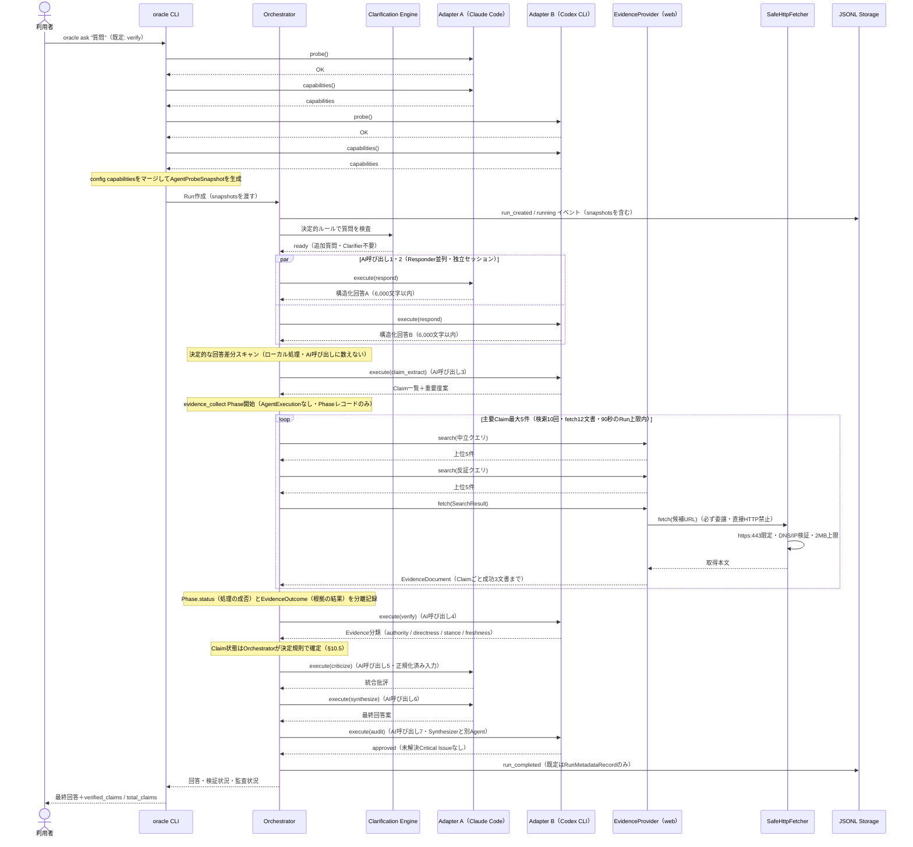
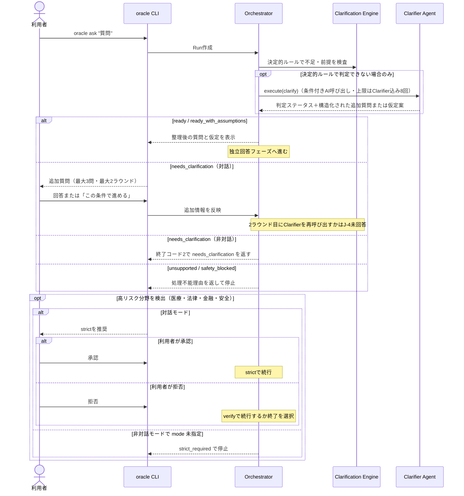
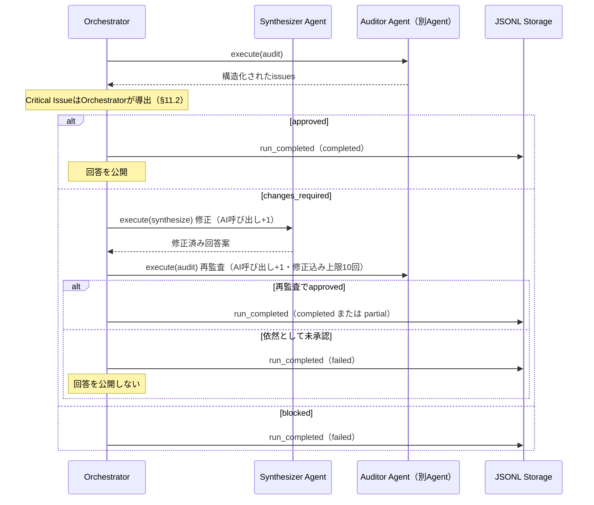
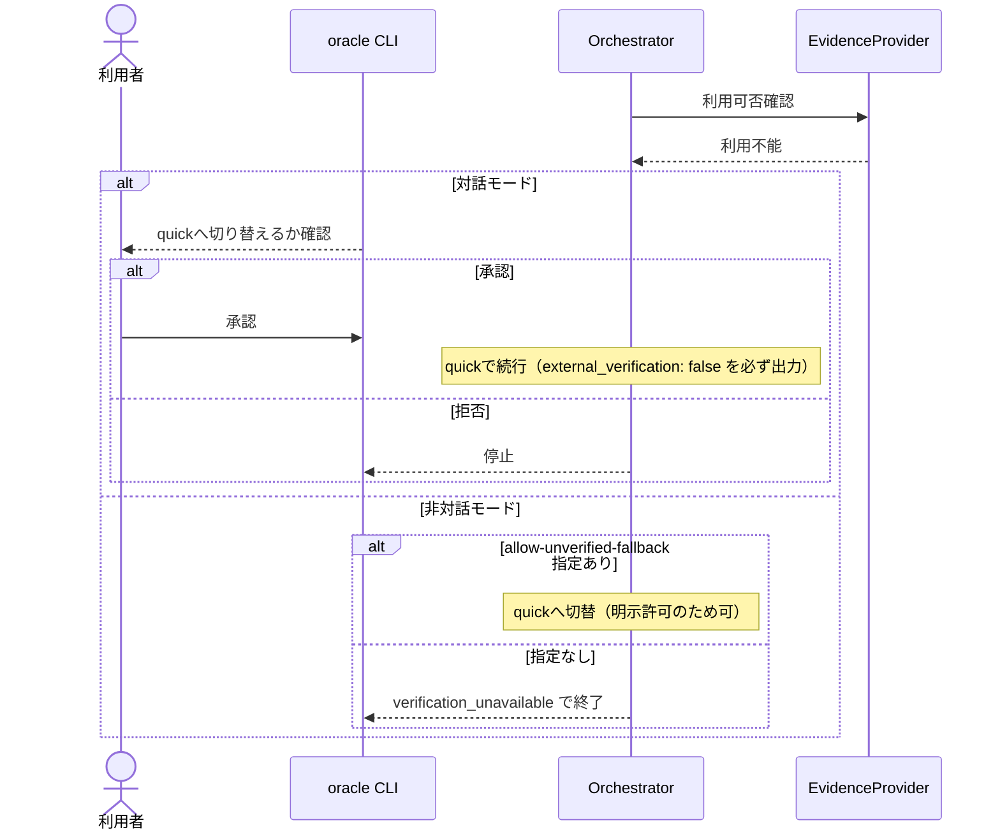
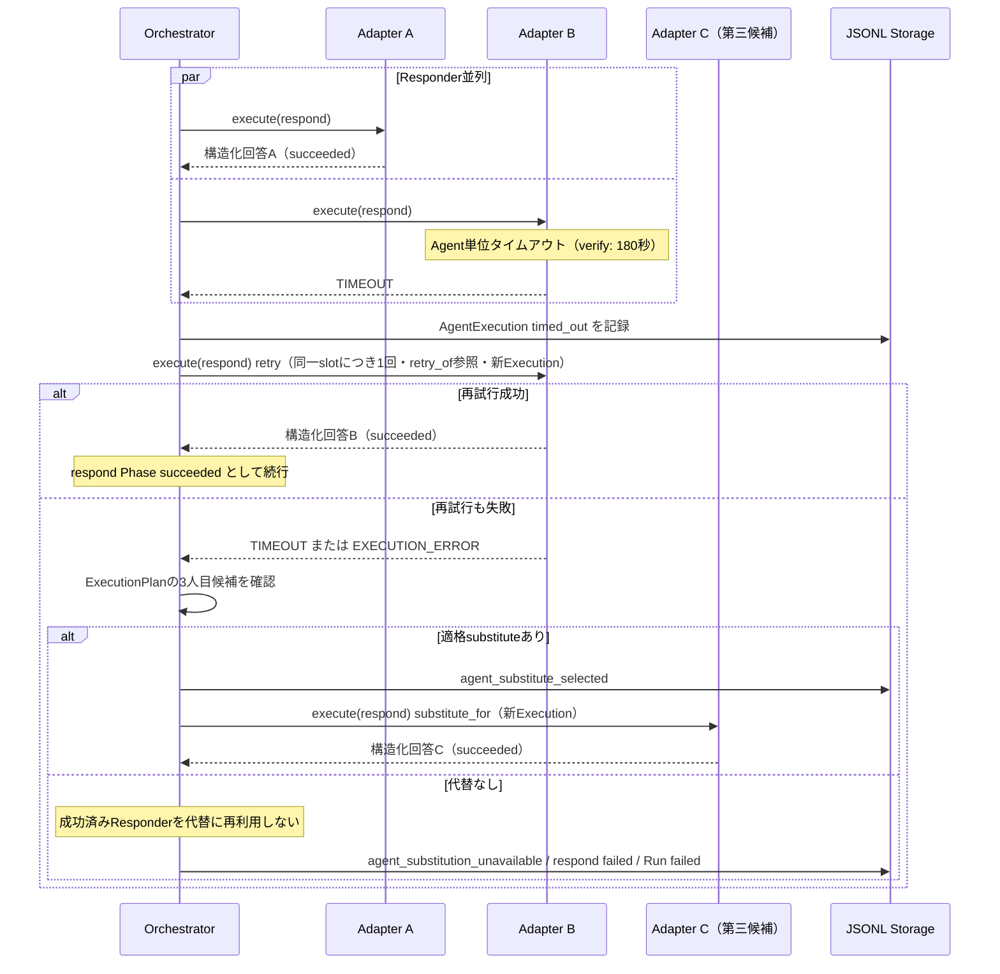
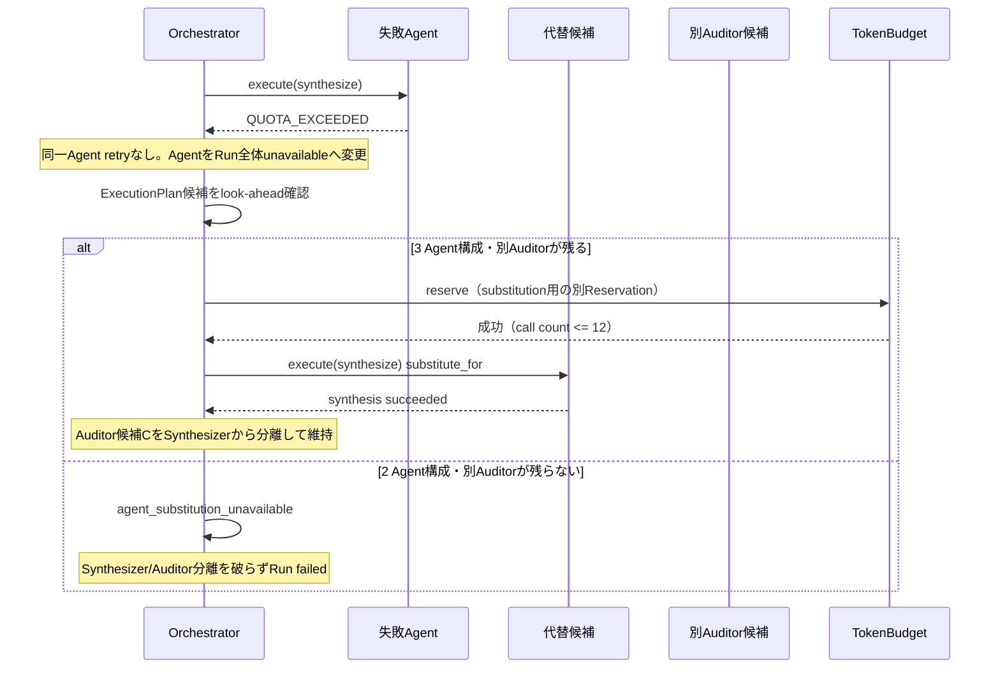
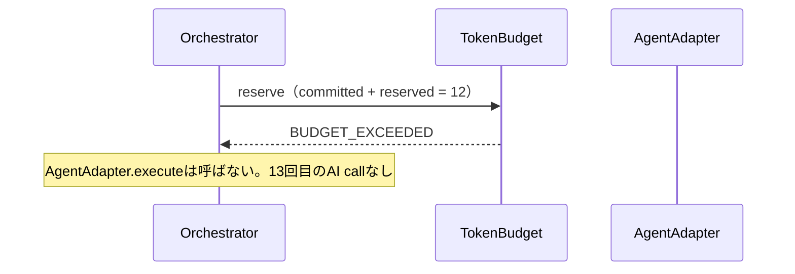
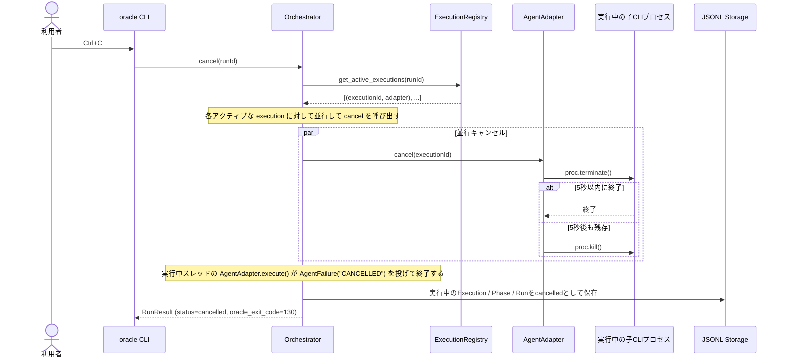
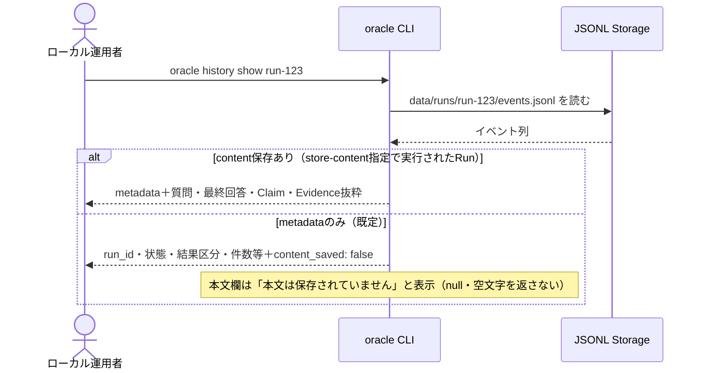

# Oracle Council シーケンス図

- 対象仕様: `SPEC.md` v0.3.3
- 対象ユースケース: `USECASE.md`
- 対象範囲: MVPの`verify`モードと周辺操作
- Agent役割の割当は§8.1の`role_priority`設定例に基づく一例。実際の割当は§6.2の決定的ルールによる

## 前提

- `quick`の実行グラフはQandA J-3が未回答のため、本書では図示しない
- CLI終了コードはSPEC §13.4の対応表（0 / 1 / 2 / 3 / 4 / 130）に従う
- ユーザー応答待ちと全体タイムアウトの関係はQandA R-3が未回答のため、図では応答待ちを時間計測外として仮置きする

## 1. 正常系: `verify`（対話モード・監査一発承認・AI呼び出し7回）

## 2. 質問整理と高リスク確認（Q-1反映）

## 3. 監査で修正が必要な場合（修正・再監査は1回だけ）

## 4. 異常系

### 4a. EvidenceProvider利用不能（暗黙のquick切替禁止）

### 4b. Responderのタイムアウトと脱落

### 4c. Agent substitutionと12回上限（X-8.16）

### 4d. 13回目の予約拒否（X-8.16）

### 4e. キャンセル（Ctrl+C）

## 5. 履歴表示（Q-2反映・metadataのみのRun）

## 6. 図に反映していない未確定事項

- J-3: `quick`の実行グラフ（未回答のため図なし）
- J-4: 追加質問2ラウンド目のClarifier再呼び出しの有無
- M-5/S-5: X-8.16で確定済み（図4b/4c/4dへ反映）
- R-2: `--json`時の進捗表示の出力先
- R-3: ユーザー応答待ち時間と全体タイムアウトの関係
- R-4: `probe()`の実行方式とカウント。S-10で事前プローブキャッシュおよび `AgentProbeSnapshot` が導入され、各エージェントにつきプローブは1回のRunあたり1回（外部CLIプロセス呼び出しは1回）に制限され、AI呼び出しの課金予算や実行回数にはカウントしない（execute実行前に行われる）ことで確定した。

M-4（`evidence_collect` Phaseと2軸モデル）、R-1（終了コード表）、S-1（Provider内部委譲）はSPEC v0.3.3、S-10（プローブキャッシュとスナップショット）はv0.3.11で確定し、本書へ反映済み。
