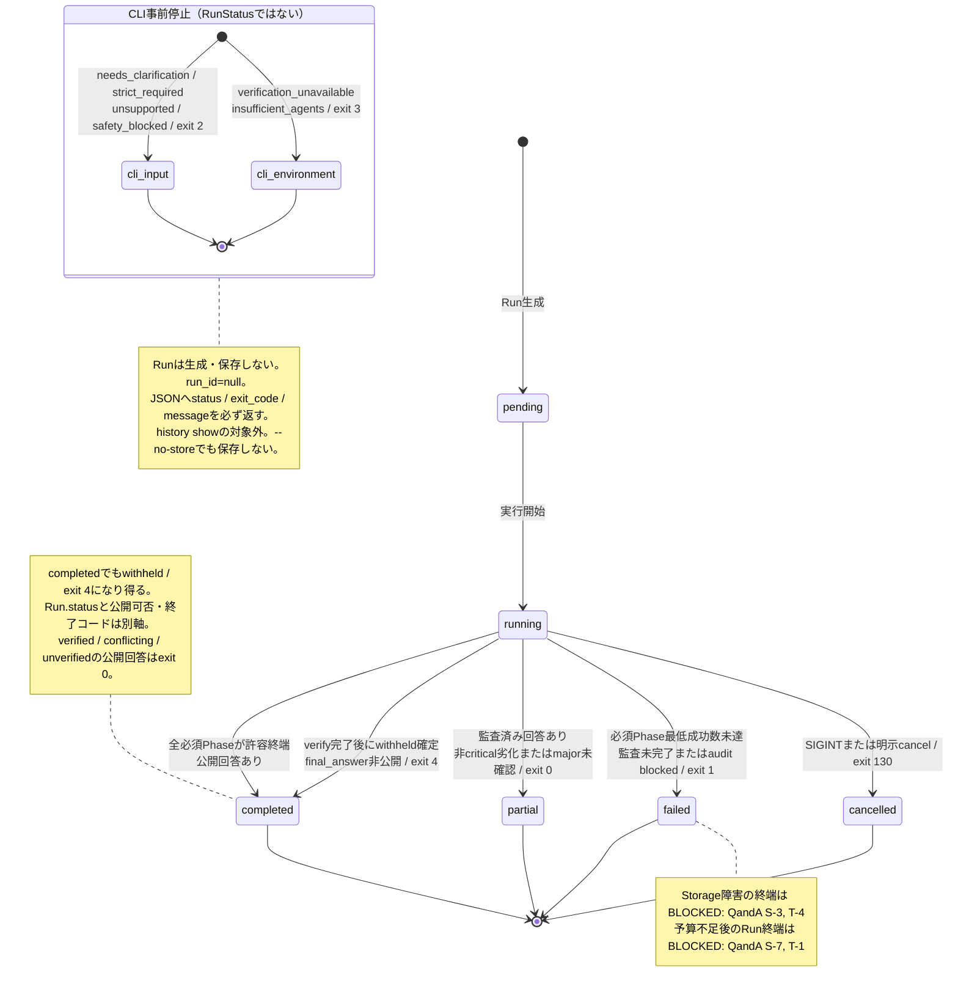
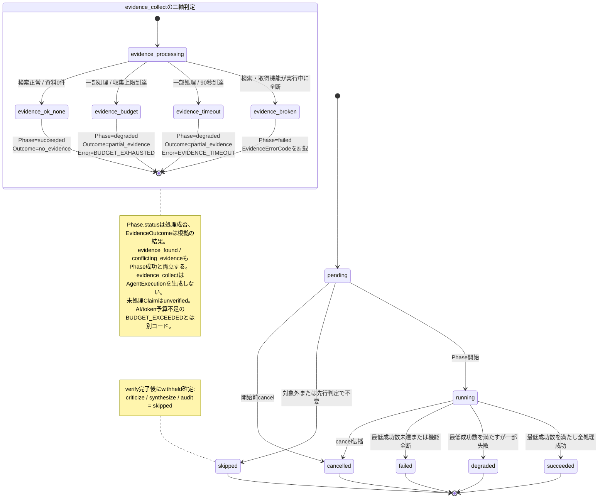
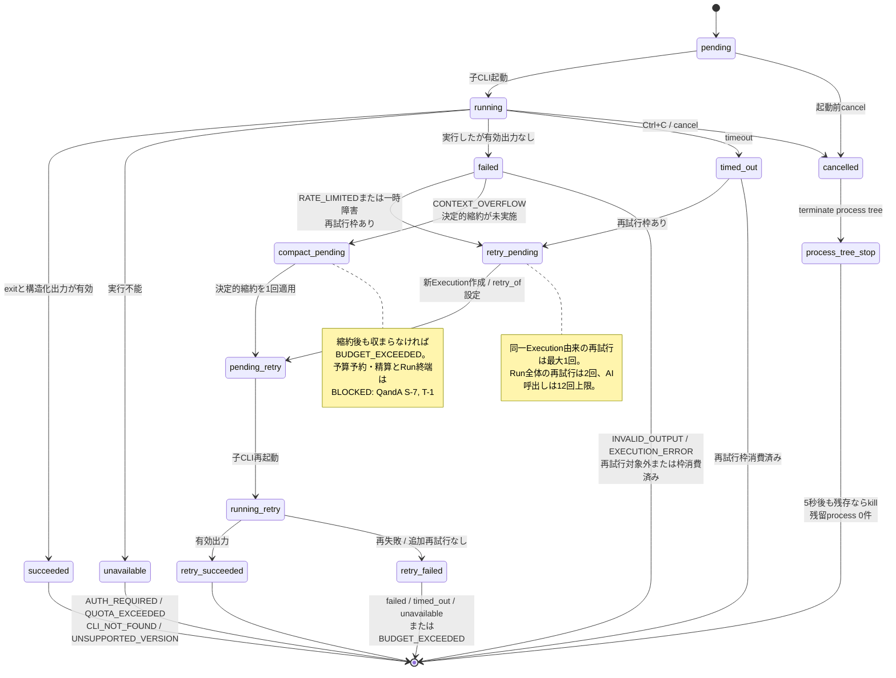
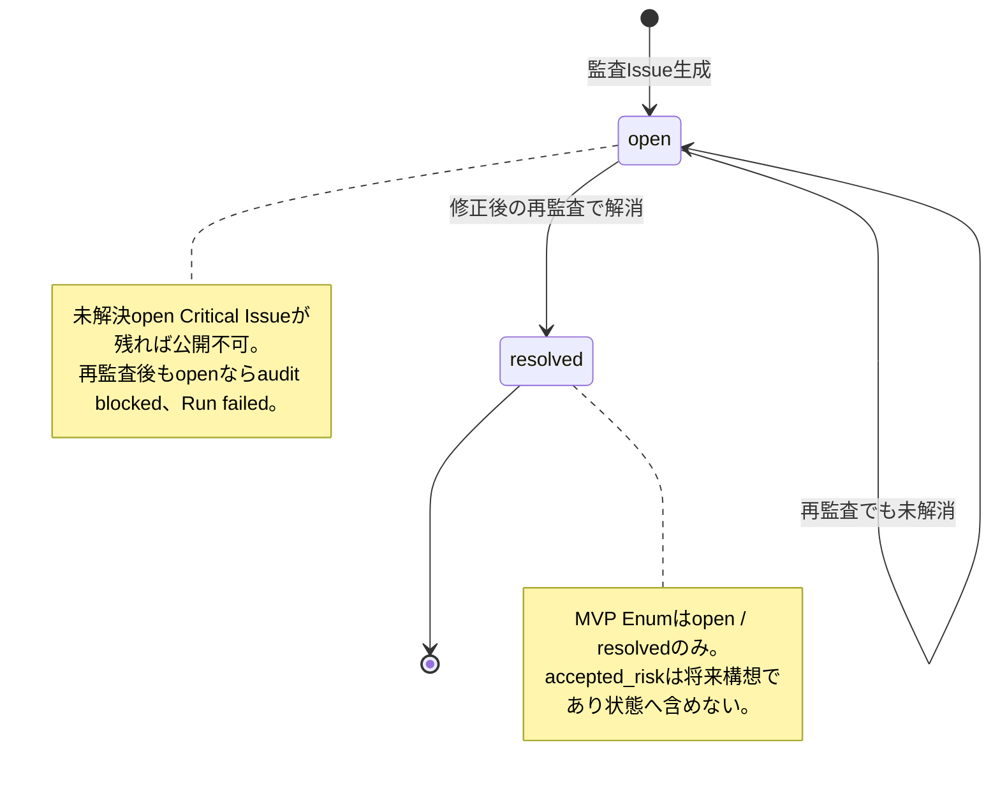
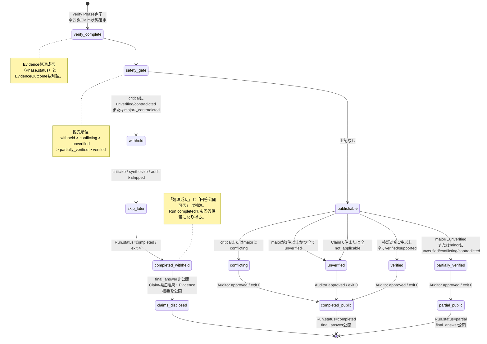

# Oracle Council 状態遷移図

- 対象仕様: `SPEC.md` v0.3.5
- 参照順: SPEC → QandA確定回答 → SEQUENCE → CLASS → TESTCASE → FIX_PLAN
- 対象範囲: MVPのRun、Phase、AgentExecution、AuditIssue、公開可否・結果分類
- 原則: 処理状態、公開可否、結果分類、CLI終了コードを別軸として扱う

## 1. Run状態遷移

`withheld`、`needs_clarification`等は`RunStatus`ではない。図中の`cli_*`はRun状態ではなく、CLIが返す`result.status`と終了コードを表す。

許可するRunStatus遷移は`pending -> running -> completed | partial | failed | cancelled`だけであり、終端状態から再遷移しない。`partially_verified`、`conflicting`、`unverified`は`ResultClassification`でありRunStatusではない。終端判定順は`cancelled -> failed -> withheldを伴うcompleted -> partial -> completed`。`partial`はAuditor承認済みの公開可能な回答があり、分類が`partially_verified`の場合だけ使用する。

## 2. Phase状態遷移

最低成功数は`respond=2`、`claim_extract=1`、`verify=1`、`criticize=1`、`synthesize=1`、`audit=1`。`clarify`は不要なら`skipped`、`evidence_collect`は`quick`等で対象外なら`skipped`とする。

## 3. AgentExecution状態遷移

再試行は同じレコードの再遷移ではなく、新しい`AgentExecution`を作り、`retry_of`で元Executionを参照する。

`error_code`は`AUTH_REQUIRED`、`QUOTA_EXCEEDED`、`RATE_LIMITED`、`CONTEXT_OVERFLOW`、`INVALID_OUTPUT`、`BUDGET_EXCEEDED`等の正式Enumを使う。`error_summary`は制限付きmetadata、生診断は`raw_diagnostic` contentへ分離する。

## 4. AuditIssue状態遷移

`accepted_risk`を将来導入しても`resolved`と同一扱いにせず、critical、安全違反、捏造引用、プロンプトインジェクション影響には使用しない。

## 5. 公開可否・結果分類

第1段の安全判定を先に実行し、公開可能な場合だけ第2段の分類を行う。

公開可能な分類でも、Auditorが`approved`でなければ`final_answer`を公開しない。`changes_required`は修正と再監査を1回だけ行い、再監査でも未解決Critical Issueが残る場合は`blocked`としてRunを`failed`へ送る。

## 6. 未確定境界

| QandA | 状態図への影響 | 本書での扱い |
|---|---|---|
| S-3 / T-4 | Storage障害時のRun終端・イベント保証 | Run図へBLOCKED注記。遷移は確定しない |
| S-7 / T-1 | TokenBudget予約不足時のRun終端・予約精算 | Run/AgentExecution図へBLOCKED注記。遷移は確定しない |
