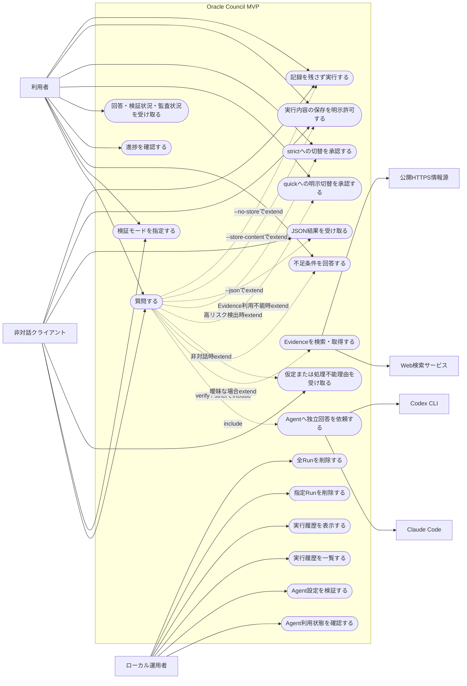
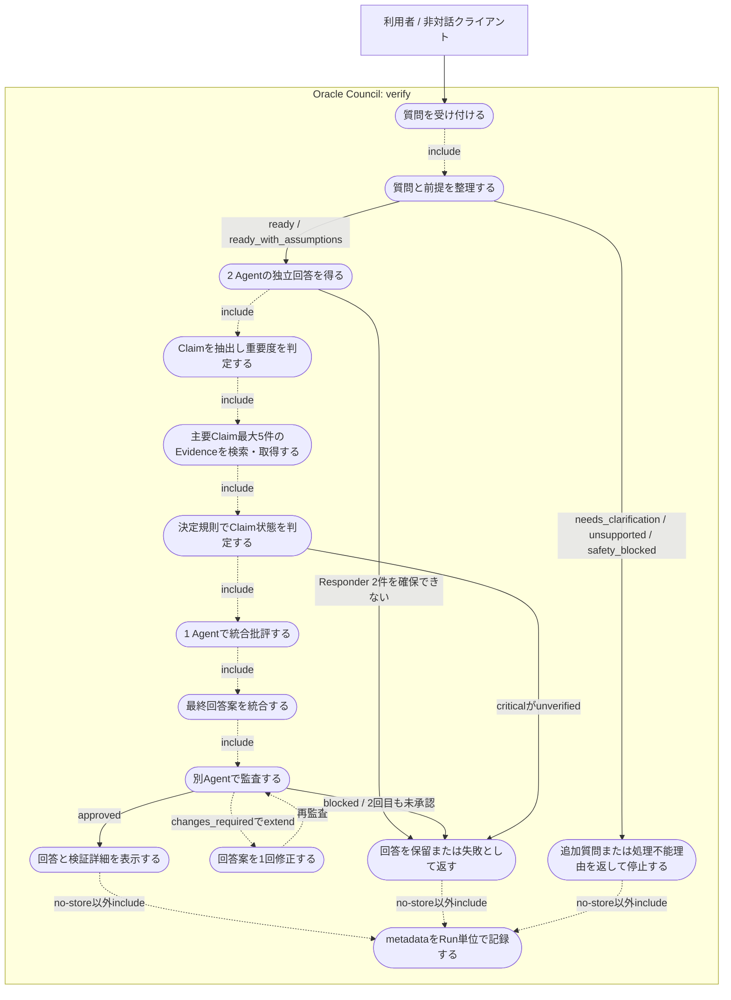

# Oracle Council ユースケース図

- 対象仕様: `SPEC.md` v0.3.2
- 対象範囲: MVP
- 表記: MermaidにUML Use Case専用構文がないため、`flowchart`の楕円ノードでユースケースを表す
- 関係: 実線はアクターの操作、`include`は必須処理、`extend`は条件付き処理

## 1. システムユースケース

## 2. `verify`回答生成ユースケース

metadata記録は既定で行い、`--no-store`指定時だけ行わない。途中失敗、キャンセル、停止のRunも記録対象とする。

## 3. ユースケースとCLIの対応

| ユースケース | CLI |
|---|---|
| 質問する | `oracle ask "質問"` |
| モードを指定する | `--mode quick\|verify\|strict` |
| 非対話で実行する | `--no-interactive` |
| JSON結果を受け取る | `--json` |
| 未検証への明示切替を許可する | `--allow-unverified-fallback` |
| strictへの切替を承認する | 対話プロンプトで承認。非対話時は`--mode`未指定なら`strict_required`で停止 |
| 内容を保存する | `--store-content`。非対話時は`--yes`も必須 |
| 記録を残さない | `--no-store` |
| Agent状態を確認する | `oracle agents status` |
| Agent設定を検証する | `oracle agents validate` |
| 履歴を一覧・表示する | `oracle history list` / `oracle history show <run-id>` |
| Runを削除する | `oracle history delete <run-id>` |
| 全Runを削除する | `oracle history purge --yes` |

## 4. 図に含めないMVP対象外

- Web UI
- SQLite
- 3つ目以降の公式サポートCLI
- Voter、Quorum、再投票
- JavaScriptレンダリング、PDF、OCR、paywall資料
- 中断Runの再開
- OSレベルの強制sandbox

## 5. 未確定箇所

- `quick`の内部ユースケースはQandA J-3が未回答のため、詳細図を作らない

Q-1（strict自動提案は確認制、非対話は`strict_required`停止）、Q-2（metadata Runの履歴は`content_saved: false`付きで正常表示）、Q-3（設定は直接編集＋`agents validate`、変更は次Runから反映）は回答確定し、SPEC v0.3.2と本書へ反映済み。

