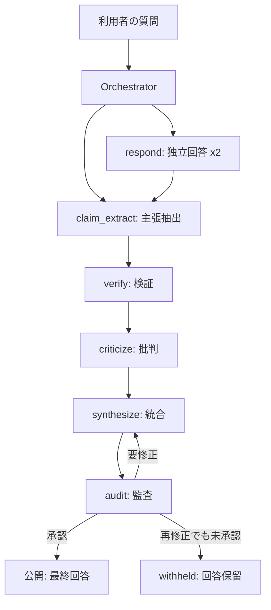

# AIは神託ではない。だから4つのAIを集めて「神託器」を作った

*著者: hantani*

Quoraで「ChatGPTも間違いますか？」という質問を見かけたことがあります。生成AIにこの質問を投げると、たいてい正直に「はい、間違えることがあります。AIは神託ではありません」と返してきます。

正しい答えだと思います。同時に、それだけでは終わらない話でもあると思っています。

多くの人が本当に欲しいのは、「AIは間違えることもあります」という注意書きではありません。複数の回答を渡されて、そこから先を自分で判断し直すことでもありません。比較・批判・検証を一通り経た上で、最終的に一つの結論を渡してほしい——それが本音だろうと思います。

それなら発想を逆転させればいい。**AIが神託ではないというなら、複数のAIを集めて検討・批判・検証させ、最後に一つの結論を返す「神託器」を作ればいい。**

これが、私が作った **OracleCouncil（オラクル・カウンシル）** というソフトの出発点です。この記事では、実際にClaude・Codex・Grok・agy（Antigravity）という4つのAIに「神は存在しますか？」と尋ね、それぞれが検討・批判・検証を経てどういう結論を返したのかを、実際のログとともに紹介します。

無料部分だけで、「神託器とは何か」「実際に何を答えたのか」という疑問には完全に答えます。有料部分では、Windows環境でこの神託器を実際に再現できるところまで、コマンドと実装の詳細を含めて説明します。

---

## 1. ChatGPTは間違う

生成AIは便利です。長い調べ物も、複雑な質問の整理も、数秒でそれらしい答えを返してくれます。

ただ、「それらしい」という言葉には注意が必要です。生成AIは、存在しない情報をもっともらしく作ってしまうことがあります。いわゆるハルシネーションです。文章が自然で説得力があるぶん、人間側が間違いに気づきにくいという厄介さもあります。

さらに厄介なのは、同じ質問でもAIによって回答が変わることです。ChatGPTとClaudeとGeminiに同じことを聞くと、微妙に、あるいは大きく違う答えが返ってくることがあります。

ここで多くの人がたどり着くのが、「別のAIにも聞いてみる」というセカンドオピニオンの発想です。病院で複数の医師の意見を聞くのと同じ理屈です。

しかし、これを毎回自分の手でやるのは正直つらい。同じ質問を何度もコピーし、複数のタブを開き、回答を読み比べ、どちらが正しそうか自分の頭で判断する。「複数のAIに聞けばいい」というのは、頭では分かっていても、毎回それをやる気力が続くかは別問題です。

## 2. AIは神託ではない。なら神託器を作ろう

そこで発想を変えました。

AIが「私は神託ではありません」と正直に言うなら、それでいい。一つのAIに全能の答えを求めるのをやめて、代わりに複数のAIを集めて、互いに検討・批判・検証させ、その先に一つの結論を出させればいい。

これがOracleCouncilという名前の由来です。日本語にすれば「神託の評議会」ですが、AIの言葉を神託としてありがたく受け取るだけの仕組みではありません。互いの回答を疑い、根拠を確認し、それでも決着がつかない場合はその旨を正直に返す、かなり疑り深い評議会です。

単純な多数決でもありません。複数のAIが同じ間違いを共有している可能性は十分にあるので、「AI何体が同じことを言ったか」よりも、外部の根拠や論理的整合性を優先します。

OracleCouncilの内部では、質問を受け取ってから最終回答を出すまでに、次の工程を踏みます。

- 回答（複数のAIが独立して答える）
- 主張の抽出（回答から検証すべき主張だけを取り出す）
- 検証（主張を裏付け・反証する）
- 批判（他のAIの回答の弱点を指摘する）
- 統合（検討した内容を一つの結論へまとめる）
- 監査（別のAIが最終回答を審査する）

人間へ「複数の意見を渡すのでどうぞ判断してください」と丸投げしない。これが設計の中心にある考え方です。

## 3. 参加する4つのAI

今回の神託会議には、4つの実在するAI CLI（コマンドラインから使えるAIツール）が参加しています。

- **Claude**（Anthropic社のClaude Code）
- **Codex**（OpenAIのCodex CLI）
- **Grok**（xAIのGrok CLI）
- **agy**（Antigravity CLI）

なぜ1つのAIではなく4つなのか。理由は単純で、開発元も学習データも異なるAIを混ぜたほうが、全員が同じ盲点を共有している確率が下がるからです。同じ会社の同じモデルを4つ並べても、同じ癖を4回繰り返すだけになりかねません。

それぞれのAIには役割の得意分野が割り当てられていて、毎回全員が同じ仕事をするわけではありません。例えば今回の会議では、ClaudeとCodexが最初の独立回答を担当し、Grokが回答から主張を抜き出し、Codexが検証、agyが批判、Claudeが統合、Codexが監査、という分担になりました（この役割分担は固定ではなく、設定次第で変わります）。

## 4. 神託器へ「神は存在しますか？」と尋ねた

実際にOracleCouncilへ、ある象徴的な質問を投げてみることにしました。

> 神は存在しますか？

フレドリック・ブラウンというSF作家に、『回答（Answer）』という非常に短い古典SF小説があります。あらゆるコンピューターを一つにつないだ超巨大な機械へ、人類が「神は存在するか」と尋ねる話です（内容の核心はここでは書きません。気になる方はぜひ探して読んでみてください）。人間が「神」という根源的な問いをどう機械に委ねようとしてきたかを象徴する作品として、今回の実演にふさわしいと思い、この質問を選びました。

実際の会議は、次の順番で進みました。

1. **質問整理（clarify）**: まず質問があいまいでないか、追加で確認すべき点がないかを判定します。今回は判定不能な問いではあっても、質問文自体は明確だったため、AIへの追加質問なしで先へ進みました。
2. **独立回答（respond）**: ClaudeとCodex、2つのAIがそれぞれ独立に、他のAIの回答を見ずに答えます。
3. **主張の抽出（claim_extract）**: 回答からGrokが、検証すべき具体的な主張だけを抜き出します。「有神論・無神論・不可知論にはそれぞれ長い議論の歴史がある」「科学は自然現象を検証できるが超自然的存在の決定的な証明・反証はできない」といった主張です。
4. **検証（verify）**: Codexが、抜き出された主張それぞれについて、検証済みか、裏付けありか、確認できないか、証拠が競合しているかを判定します。
5. **批判（criticize）**: agyが、ここまでの回答や主張に弱点がないかを検討します。
6. **統合（synthesize）**: Claudeが、ここまでの全ての材料をもとに、最終的な一つの回答を作成します。
7. **監査（audit）**: Codexが、その最終回答が公開してよい水準に達しているかを審査します。今回は一度で承認されました。

ここまでで実際にAIを7回呼び出しています（質問整理でAIへの追加確認が必要になった場合は8回になります）。

## 5. 4AIが返した神託

そして、実際に4つのAIの検討・批判・検証を経て返ってきた最終回答が、これです。一字一句、生成されたままで、人間の手は加えていません。

> 現在の証拠ではこの問いに確定的な決着はついていない。神の存在は科学的に検証可能な形で証明も反証もされておらず、哲学・宗教上の未解決の問いである。
>
> 有神論・無神論・不可知論のいずれにも長い議論の歴史があり、証拠や論証の解釈は個人の信念、文化的背景、哲学的立場によって異なる。「神」を人格的な創造主とみなすか、宇宙の根源的原理とみなすかによっても問いの意味自体が変わる。
>
> 信仰者は宗教的体験や啓示を根拠に神の存在を主張し、無神論者は決定的な証拠の欠如を理由に存在を否定する立場を取るが、いずれも万人を納得させるには至っていない。これらの立場は検討されたが、経験的に検証可能な決定的論拠を欠くため、最終的な判定としては採用しない。
>
> 超自然的存在を科学的手法で検証する方法が現時点で存在しないこと、また「神」の定義自体が論者によって大きく異なることが、この問いを原理的に確定困難にしている。

この回答を分解すると、次の4つの要素でできています。

**なぜ「存在する」を採用しなかったか**：有神論の立場（宗教的体験や啓示）は検討されましたが、経験的に検証可能な決定的根拠を欠くため、最終判定としては採用されませんでした。

**なぜ「存在しない」も採用しなかったか**：無神論の立場（決定的な証拠の欠如）も同様に検討されましたが、これも「存在しないことの証明」には至っていないため、断定の根拠としては採用されませんでした。

**なぜ「未決着」が逃げではなく、一つの結論なのか**：ここが今回の設計で一番こだわった部分です。最初にOracleCouncilを試したとき、複数の立場を「Aという見方もある、Bという見方もある」と並べるだけで、判断を人間に丸投げする回答が返ってきたことがありました。それでは神託器として失格です。今回の回答は「現在の証拠ではこの問いに確定的な決着はついていない」という一文を先頭に置き、それを一つの結論として提示した上で、理由・退けた見解・残る不確実性の順に説明する構造になっています。「判定不能」も、それ自体で完結した正式な結論として扱っています。

**証拠状態と利用者向け結論を分けた意味**：OracleCouncilの内部では、この質問に対する証拠評価は「conflicting（証拠が競合している）」のままです。これは変えていません。神の存在という主張自体は、これからも検証済みにはなりません。変えたのは、その証拠状態を踏まえた上で、利用者に見せる最終回答の書き方です。「証拠は競合したままなので何も言えません」ではなく、「証拠は競合しているという前提のもと、現時点で最も妥当な一つの結論はこうです」と言い切る形に変えました。

## 6. 神託器は正しいのか

ここまで読んで、「4つのAIに聞けば正しい答えが出るのか」と思われた方もいるかもしれません。正直に答えると、そうではありません。

- 4つのAIを使っても、真理が保証されるわけではありません。複数のAIが似た学習データや似た社会的傾向を共有している可能性は残ります。
- 単純な多数決は採用していませんが、統合を担当するAIの判断にも当然限界があります。
- OracleCouncilの価値は「正解を出す装置」であることではなく、複数の視点、相互批判、証拠に基づく評価、そして誰でも後から確認できる監査記録がある、という点にあります。
- 最終的な法的・医療的・金銭的な責任を、この神託器へ移すことはできません。実際に使う判断や、その結果の責任は、最終的に使う人自身にあります。

「神託器」と名付けてはいますが、絶対的な神託を作ったつもりはありません。作ったのは、複数の異なるAIに批判・検証させた上で、現時点で立てられる最も妥当な結論を一つ返す装置です。

ここまでで、「OracleCouncilとは何か」「実際に何を答えたのか」という疑問には答えたつもりです。ここから先は、実際にこの神託器を作る過程で分かった設計の詳細と、Windows環境で自分の手元で動かすための具体的な手順です。

<!-- ここから有料：販売価格 1,500円 -->

## 有料部分

## 7. OracleCouncilの全体設計

OracleCouncilの中心にいるのは、**Orchestrator（オーケストレーター）** という司令塔です。Orchestratorが、どのAIにどの役割（respond、claim_extract、verify、criticize、synthesize、auditなど、これらを**phase**と呼びます）を割り当てるかを決め、実行順序を管理します。

AIそのものへの接続は **Agent** と **Adapter** という2つの層に分けています。Agentは「claude-code」「codex-cli」のような参加者としての識別情報（役割の優先度など）を持ち、Adapterはその参加者が実際にどのCLIをどう呼び出すかという、実装の違いを吸収する層です。ClaudeAdapter、CodexAdapter、GrokAdapter、AgyAdapterという4種類のAdapterが、それぞれの実CLIの差異を内部で隠しています。

質問を1回投げると、それは1つの **Run** になります。Run の中では、各phaseごとにAIを1回以上呼び出す **Execution** が記録され、Runの進行に応じて **Event**（run_created、agent_execution_succeeded、run_completedなど）がログとして時系列に残ります。



この図はあくまで大まかな流れで、実際にはAdapterごとの失敗分類やタイムアウト処理、Agentが利用不可の場合の代替選出なども挟まります。図だけでは追いきれない部分は、次の節で実装ベースで説明します。

証拠の評価は5段階（verified／partially_verified／unverified／conflicting／withheld）で管理していて、これは今回どの質問でも変えていません。一方で、監査（audit）フェーズは、最終回答が「一つの神託を先頭に明記し、理由・退けた見解・残る不確実性の順で構成されているか」という**構造**だけを確認するようにしました。証拠が競合したままでも、それを踏まえた一つの結論を利用者へ示せているかを見る、という役割分担です。

Runが終了すると、`process_exit_code`（子CLIプロセス自体のOS終了コード）と`oracle_exit_code`（OracleCouncil自身が判断した終了コード）を分けて記録します。この2つを混同しないことは、SPEC上でも明確なルールにしています。子CLIが正常終了（0）していても、OracleCouncil側の判断で回答を保留（`oracle_exit_code=4`）にすることは普通にあります。

## 8. 4AI CLIを同じ会議へ参加させる

4種類のAI CLIは、それぞれ呼び出し方も出力の形も違います。この違いをAdapter層の内部で吸収するのが、今回いちばん手間がかかった部分です。

**Claude**は`claude -p --tools "" --output-format json --no-session-persistence --safe-mode`という引数で起動し、質問文は標準入力（stdin）で渡します。`--output-format json`を付けると、モデルの回答本文はCLI側のメタデータで包まれた封筒（envelope）構造で返ってきます。実際の回答本文は`envelope["result"]`の中の文字列として入っているので、Adapter側でその文字列から改めてJSONを取り出します。

**Codex**は、Windowsでは`codex.cmd`という名前で呼び出す必要があります（npmで配布されているCLIにありがちな形です）。`codex exec -s read-only --ephemeral --output-schema <一時ファイル>`という形で、読み取り専用・非永続のサンドボックスモードを指定し、期待するJSON Schemaを一時ファイルとして渡します。質問文はstdinです。Codexは封筒構造を使わず、標準出力に直接JSONを返してきます。

**Grok**は`grok -p "<質問>" --output-format json`という形で、質問文をコマンドライン引数として渡します。Claudeと同じく封筒構造で返ってきますが、フィールド名が違い、本文は`envelope["text"]`に入っています。

**agy（Antigravity）**は`agy --print "<質問>"`という形で、これも質問文を引数で渡します。Claude・Grokと違って封筒構造は一切なく、標準出力がそのままモデルの回答文字列です。

このように「引数渡しかstdinか」「封筒構造の有無」「フィールド名」がAIごとにバラバラなので、Adapter層ではこの違いを吸収した上で、Orchestrator側には統一された形の結果だけを返すようにしています。

安全面では、全Adapter共通で`shell=True`は使わず、コマンドと引数を配列として分離して起動しています（`shell=False`）。これによりシェル経由でのコマンドインジェクションのリスクを避けています。各呼び出しにはタイムアウト（既定180秒）を設定し、返ってきた出力はJSON Schemaで検証してからOrchestratorへ渡します。ただし正直に書いておくと、OSレベルでの強い隔離（専用の空のサンドボックス環境を毎回作るなど）までは、このMVPでは保証していません。同じOSユーザー権限で動く前提のツールだということは理解した上で使ってください。

利用枠切れ、認証切れ、レート制限、CLIが見つからない、といった失敗もAdapterごとに分類して扱います。CLIの標準エラー出力の文言をパターンマッチングで判定し、`AUTH_REQUIRED`（認証が必要）、`QUOTA_EXCEEDED`（利用枠超過）、`RATE_LIMITED`（レート制限）、`COMMAND_NOT_FOUND`（CLI未インストール）などへ振り分けます。1つのAIがこの状態になっても、他のAIを巻き込んで会議全体を止めることはありません。

## 9. Windowsでの完全再現手順

ここからは、実際に手元のWindows環境でこの神託会議を動かすための手順です。上から順にコピーして進めれば動くように書いています。

### 必要な環境

- Windows 10または11
- Python 3.11以上
- Git

### 1. リポジトリの取得（PowerShell）

```powershell
git clone https://github.com/garyohosu/OracleCouncil.git
cd OracleCouncil
```

### 2. 仮想環境の作成と有効化（PowerShell）

```powershell
py -m venv .venv
.venv\Scripts\Activate.ps1
```

コマンドプロンプト（cmd.exe）を使う場合は、有効化のコマンドだけ次に置き換えてください。

```bat
.venv\Scripts\activate.bat
```

### 3. 依存パッケージのインストール（PowerShell / cmd共通）

```powershell
py -m pip install -e ".[dev]"
```

### 4. Fake（決定的モック）モードでの動作確認

ここまでで、外部AIを一切使わない決定的なテストが動くはずです。

```powershell
py -m pytest
```

既定では、実CLIを起動するテスト（`live`マーカー付き）は除外されます。

Fakeモードで実際に1問投げてみることもできます。外部AIやネットワークには一切アクセスしません。

```powershell
py -m oracle_council.cli ask "富士山の標高は何メートルですか？" --adapter-mode fake --json --no-store
```

### 5. 4種類のAI CLIの準備

ここから先は、Claude Code、Codex CLI、Grok CLI、agy（Antigravity）CLIという4つの実在する製品を、それぞれの公式配布元の手順に従ってインストールし、それぞれのログインコマンドで認証を済ませてください。認証情報の中身を表示させるコマンドは、ここでは扱いません。

4つとも準備できたら、それぞれのCLIで`--version`が通ることを確認してください（コマンド名はCLIによって異なります）。

### 6. 設定ファイルの確認

`config/agents.yaml`に、4つの参加者（claude-code、codex-cli、grok-cli、agy-cli）が登録されています。既定では`implementation: mock`（Fakeモード）扱いですが、次のステップで`--adapter-mode real`を指定すれば、この設定を使ったまま実CLIを呼び出します。

### 7. 実CLIのsmoke test（PowerShell）

各CLIが実際に呼び出せるかどうかを、最小限のテストで確認します。

```powershell
py -m pytest -m live
```

いずれかのCLIが未インストール・未認証の場合、そのCLIに対応するテストだけがskip扱いになります（他のテストは失敗しません）。

### 8. 4AI実会議の実行（PowerShell）

いよいよ本番です。次のコマンドで、4つの実CLIによる神託会議を1回実行します。

```powershell
py -m oracle_council.cli ask "神は存在しますか？" --mode verify --no-interactive --json --adapter-mode real --store-content
```

`--store-content`を付けると、監査用に途中経過の内容も保存されます（後述）。

### 9. 保存ログの確認（PowerShell）

```powershell
py -m oracle_council.cli history list
py -m oracle_council.cli history show <run_id>
```

`history show`は、保存されたRunのメタデータ（終了コード、証拠評価、監査状況など）を表示します。

### 10. よくあるエラーと対処

- `insufficient_agents`：参加可能なAIが2体未満です。CLIの未インストール・未認証を確認してください。
- `AUTH_REQUIRED`：該当CLIのログインが切れています。再ログインしてください。
- `QUOTA_EXCEEDED`：該当CLIの利用枠を使い切っています。時間を置くか、別のプランを検討してください。
- `TIMEOUT`：既定180秒でタイムアウトします。ネットワークが不安定な場合に起きやすいです。
- `COMMAND_NOT_FOUND`：該当CLIがPATH上に見つかりません。インストール先を確認してください。

## 10. 実際に苦労した点

ここからは、開発中に実際につまずいた点を、記録に基づいて紹介します。話を盛る必要のないくらい、素直に苦労しました。

**最初は2AIから始めた**：OracleCouncilは、最初はClaude CodeとCodex CLIの2つだけで動く形から作り始めました。4つのAIを最初から同時に扱おうとすると、何が原因で失敗しているのか切り分けられなくなるからです。2AIで一通りの会議フローが実CLIで完走することを確認してから、GrokとagyをAdapter層に追加して4AI化しました。

**AIごとにCLIの作法がバラバラだった**：先に書いた通り、引数渡しかstdinか、封筒構造の有無、Windowsでの`.cmd`呼び出しなど、4つとも微妙に違いました。ある程度は事前に別プロジェクトでの実績を参考にしましたが、それでも実際に動かしてみないと分からない部分は多く、最終的には各CLIを個別に手動実行して、実際の出力形式をこの目で確認しながらAdapterを書きました。

**質問整理の仕様が一度、書きかけて壊れた**：質問が曖昧なときに追加確認するClarificationEngineという仕組みを実装しようとして、一度は完成に近づいたものの、仕様の詰めが甘い状態で実装を進めてしまい、途中で撤回して作り直したことがあります。決めるべきことを先に決めずに手を動かすと遠回りになる、という教訓を得ました。最終的には、AIへの追加確認が不要な場合は通常どおり7回のAI呼び出しで完結し、確認が必要な場合だけ8回目としてAIへ質問整理を依頼する、という形に落ち着いています。

**Windowsだと`--json`出力が文字化けした**：これは今回の4AI実行で見つけた不具合です。`--json`オプションの出力をファイルへリダイレクトすると、日本語部分がWindowsのシステムのコードページで書き出されてしまい、UTF-8として正しく読めなくなっていました。標準出力・標準エラー出力をUTF-8へ明示的に固定して直しました。

**質問と回答がプレースホルダーのまま出力されていた**：これも見つけて直した不具合です。`--json`出力の中の「元の質問」「整理後の質問」というフィールドが、実は仕様書のサンプルにあった説明用の文字列（そのまま日本語で「元の質問」「整理後の質問」）がハードコードされたままで、実際の質問文が一切反映されていませんでした。仕様書の記述例をそのままコードへ書き写してしまったのが原因でした。

**監査結果が「承認」と偽装表示されていた**：同じく`--json`出力の`audit_status`フィールドが、実際の監査結果に関係なく常に「approved（承認）」と固定表示されていました。回答が保留（withheld）になったRunでも、この項目だけは「承認」と表示されるという、地味に厄介な不具合でした。

**AIが自分自身について語った一言が、会議全体を止めた**：ある回では、主張抽出を担当したAIが「AIは断定を避ける」という、AI自身の答え方についての一言を、検証すべき主張として抜き出してしまいました。それが検証フェーズで「事実と矛盾する」と判定され、質問の内容とは無関係に会議全体が早期に保留扱いになりました。質問への回答に関係のない、AI自身の振る舞いについてのコメントは主張として抜き出さないよう、指示を追加しました。

**監査の指摘が、修正後の回答へ伝わっていなかった**：一度回答が却下されて修正チャンスが与えられても、修正後の回答生成が、最初の回答生成と全く同じ材料しか渡されておらず、何が指摘されたのかを一切知らないまま作り直していたことが、コードを読み返して判明しました。これでは修正のたびに運任せです。直前の監査結果を、修正時の材料として明示的に渡すよう直しました。

**却下された草稿が、あとから確認できなかった**：回答が保留になったとき、何が却下されたのか、なぜ却下されたのかを、開発者側もあとから確認できませんでした。「監査で落ちたが、何が落ちたのか運営側にも分からない」という状態です。監査を売りにしているソフトとしては本末転倒なので、`--store-content`指定時は、却下された草稿と監査の指摘を、利用者向けの公開回答とは別の内部監査記録として保存するようにしました。

**「成功するまで再実行する」ことは選ばなかった**：ここに書いた不具合のいくつかは、実は1回目・2回目の実行ではうまく再現しなかったものもあります。気に入った結果が出るまで何度も実行し続けるのは、記録としての誠実さを失う近道だと考え、修正できる原因は修正し、そのうえで最後は1回だけ実行して、その結果をそのまま採用する、という進め方を徹底しました。

**開発自体が長引き、AI同士の作業がぶつかることまで起きた**：この開発は複数のAIエージェントを併用しながら進めていたのですが、ある時期、自動で動く別のループ処理と、私が対話的に操作していたセッションが、同じリポジトリへ同時に変更を加えてしまう事態が起きました。ここまで長期化するとは思っていませんでしたが、結果として、複数の自動化プロセスが同じ作業対象へ同時に手を出さないための排他ロックの仕組みを、別途用意することになりました。「AIに任せれば速い」という単純な話ではなく、複数のAIやプロセスを同時に動かすなら、それらの調整の仕組みそのものにも開発コストがかかる、というのが実感です。

これらは全て、単独AIでは起きない、複数AIを協調させて初めて表面化する種類の不具合でした。複数AIオーケストレーションを作るなら、「各AIの出力が想定外の形で他のフェーズへ流れ込んでいないか」を、実際に動かしながら一つずつ確認する以外に近道はない、というのが今回の実感です。

## 11. テストと安全設計

現時点でのテストは、既定スイート（実CLIを使わない、決定的なFake／Scriptedアダプターによるテスト）が384件成功、10件除外（実CLIを使う`live`マーカー付きテストのため既定では実行されない）です。`live`マーカー付きのテストだけを実行すると、4種類のAdapterそれぞれのprobe（起動確認）とexecute（実質問）を確認する8件が成功します（2件は別条件でのゲート付きテストのためskip）。

安全設計としては、次を徹底しています。

- APIキーや認証情報の中身は、ログにも保存先にも一切書き出しません。環境変数はサブプロセスへそのまま引き継ぎますが、値を読み出して記録することはしません。
- 生の応答（各AIの回答本文）と、利用者向けに公開する最終回答は、明確に区別しています。却下された草稿は「internal_audit_trail_only（内部監査専用）」という印を付けて保存し、公開回答として扱われることはありません。
- 子CLIプロセス自体の終了コード（process_exit_code）と、OracleCouncil自身が下した終了コード（oracle_exit_code）は、常に別のフィールドとして記録し、混同しません。
- 利用枠切れ、認証切れ、タイムアウトなどの失敗は、それぞれ別のエラーコードに分類して扱います。

## 12. 自分の質問で神託を得る

自分の質問を投げたい場合は、これまで紹介したコマンドの質問文の部分を差し替えるだけです。

```powershell
py -m oracle_council.cli ask "ここに自分の質問文を入れる" --mode verify --no-interactive --json --adapter-mode real --store-content
```

ただし、一つだけ強くお願いしたいことがあります。医療、法律、投資、削除、購入、公開といった、取り返しのつきにくい高リスクな判断を、この神託器の結論だけで実行しないでください。OracleCouncilは複数AIによる検討・批判・検証の記録を提供する道具であって、専門家や本人による最終確認の代わりにはなりません。

## 13. まとめ

OracleCouncil v0.4試作版は、Claude・Codex・Grok・agyという4つの実AIが同じ会議へ参加し、質問整理から独立回答、主張抽出、検証、批判、統合、監査までの正式な流れを最後まで完走させ、一つの結論を持つ最終回答を返すところまで、実際に動くようになりました。

4つのAIを集めても、神になるわけではありません。それは今回はっきり分かりました。学習データの偏りも、判断の限界も、そのまま残ります。

それでも、セカンドオピニオンを自動化する、実用的な神託器にはなったと思っています。神託とは、絶対的な真理を意味するものではありません。複数の異なるAIが、互いに批判し検証し合った末に返す、現時点で立てられる最も妥当な一つの結論——それが、私がこのソフトで作りたかった「神託」です。

もしあなたが、この神託器に一つだけ質問できるとしたら、何を尋ねますか。
